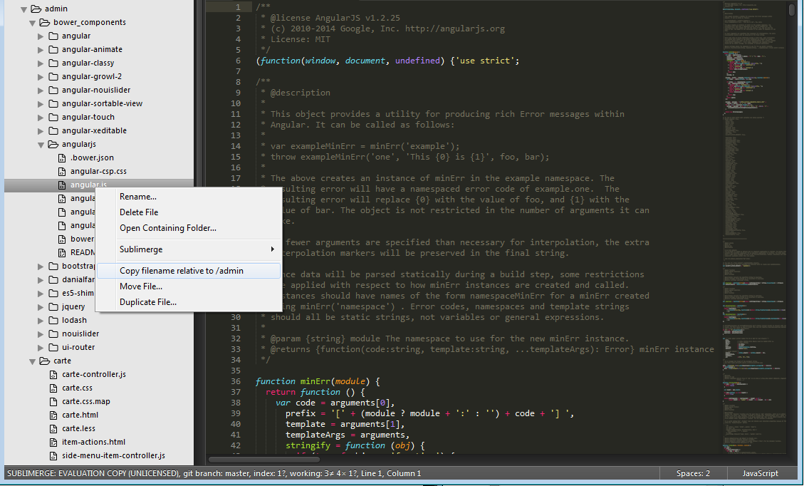

# FileActions

## Description

Adds 3 operations to the Sidebar menu:
- Copy filename
- Move file
- Duplicate file

Sidebar Enhancements is a full featured plugin, but I only needed a small part of its functionality, so I made this plugin.

It can also copy the filename, which is useful for inserting src &lt;script&gt; tags from bower_components after installing a new dependency using bower




## Copying from a relative path

If you don't want to copy the filemname from the root of your project, create the file Packages/User/FileActions.sublime-settings (the User folder is accessibled from Preferences -> Browse Packages ... in the menu of SublimeText), and paste the following:

```
{
	"copy_filename_root": "/admin"
}
```
